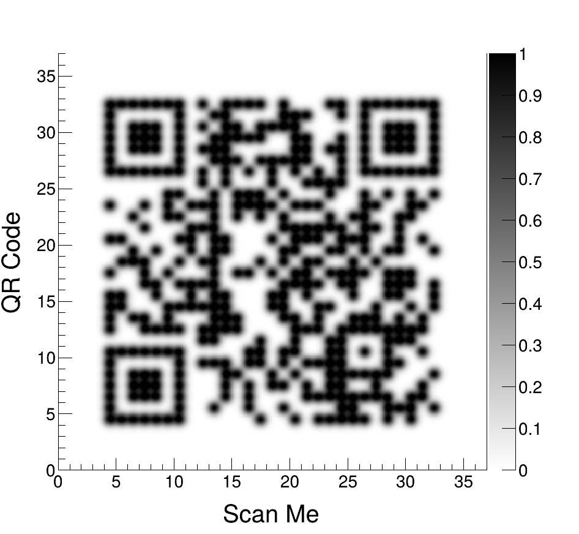

# rootqr

A single self-contained ROOT macro that turns a URL into a **scannable QR code
rendered as a `TH2D`**, where every dark module is painted with a 2D Gaussian
centered on the module (each module is a `sub × sub` grid of sub-pixels: the
center is fully filled, neighbors fade out, and the tail dies before reaching
the next module). It's drawn with `COLZ` and saved as a PNG — the y-axis reads
`QR Code` and the x-axis `Scan Me`.



## Usage

```sh
root -l -q 'qrcode.C("https://root.cern")'
root -l -q 'qrcode.C("https://root.cern","ocean")'
root -l -q 'qrcode.C("https://example.com/p?q=1","kBird","H",9,0.40,4,"out.png")'
```

| arg       | default             | meaning                                                              |
|-----------|---------------------|----------------------------------------------------------------------|
| `url`     | `https://root.cern` | text/URL to encode (byte mode → any UTF-8)                           |
| `scheme`  | `classic`           | a built-in gradient or a ROOT palette — see **Palettes** below       |
| `ecc`     | `H`                 | error-correction level `L`/`M`/`Q`/`H` (`H` is most robust)          |
| `sub`     | `9`                 | sub-pixels per module per axis (the “9×9 grid”)                      |
| `sigma`   | `0.40`              | Gaussian σ in **module units** (dot size)                            |
| `quiet`   | `4`                 | quiet-zone width in modules (spec requires ≥ 4)                      |
| `outfile` | `qr.png`            | output image; extension picks the format (`.png`, `.pdf`, `.svg`, …) |
| `xtitle`  | `Scan Me`           | x-axis title                                                         |
| `ytitle`  | `QR Code`           | y-axis title                                                         |
| `title`   | `""`                | optional plot title drawn above the frame (empty → no title)         |

Everything is built in — no external tools or libraries. The encoder (a compact
port of Project Nayuki's public-domain QR generator) picks the smallest version
that fits and the lowest-penalty mask automatically.

## Palettes

`scheme` accepts any of:

- a **built-in gradient**: `classic`, `inverted`, `root`, `matrix`, `ocean`,
  `fire`, `sunset`, `purple`;
- any **ROOT predefined palette** by name or number — `kBird`, `kViridis`,
  `kRainBow`, `kSolar`, `57`, … (the
  [“High quality predefined palettes”](https://root.cern/doc/master/classTColor.html)
  list, 51–113);
- a trailing **`_r`** reverses the palette, e.g. `kViridis_r`, `classic_r`.

```sh
root -l -q 'qrcode.C("https://root.cern","kBird")'
root -l -q 'qrcode.C("https://root.cern","kViridis_r")'
```

Scannability note: most ROOT palettes run dark->bright, so the code comes out as
**bright modules on a dark background** (an inverted QR) — read fine by phone
apps. Append `_r` (e.g. `kViridis_r`) for a dark-on-light code that scans on any reader.
Avoid palettes with little light/dark contrast(e.g. `kRainBow`),
where modules and background end up at similar luminance.

## How the rendering works

The matrix goes into a `TH2D` of `(size + 2·quiet)·sub` bins per side. Each dark
module *adds* a 2D Gaussian (σ in module units), so adjacent dark modules merge
into solid runs (finder patterns, timing, …) while isolated ones stay contained
dots. Every bin is filled, so `COLZ` paints the whole frame: value 0 maps to the
scheme background and the peak saturates to the dark colour. Row 0 of the QR is
placed at the top so the image isn't mirrored. `σ ≈ 0.40` is large enough that
each module clearly registers, small enough that a module's tail doesn't light up
its neighbors' centers.
